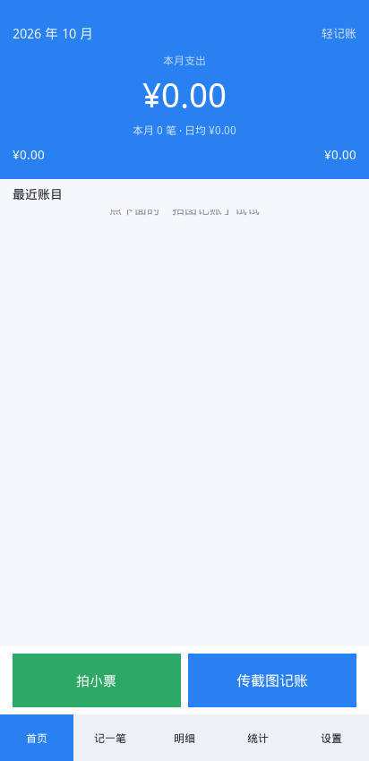
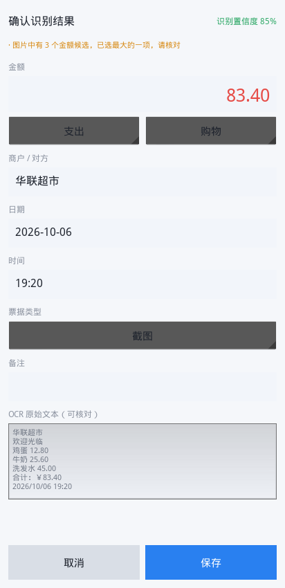
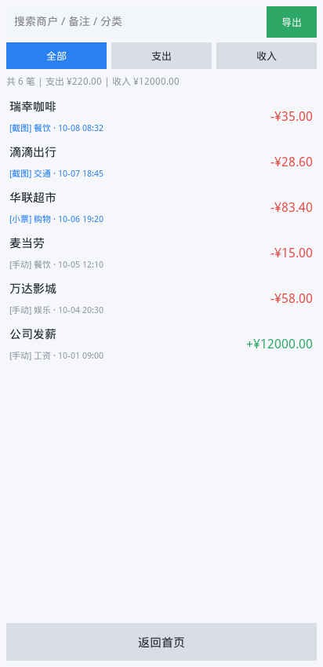
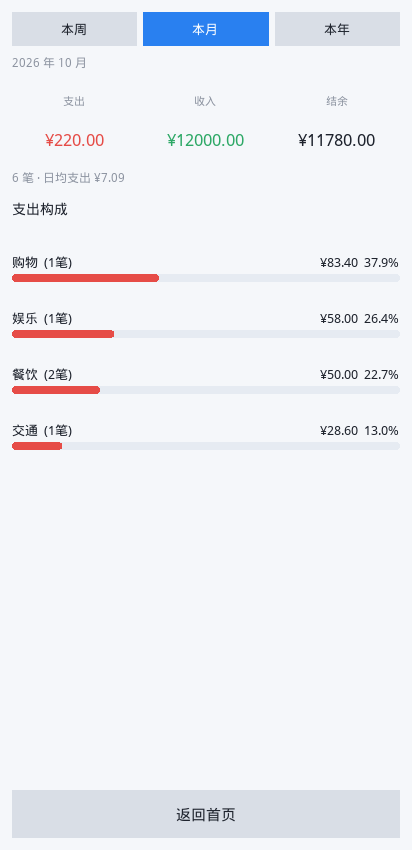
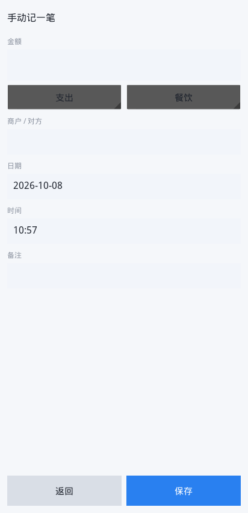
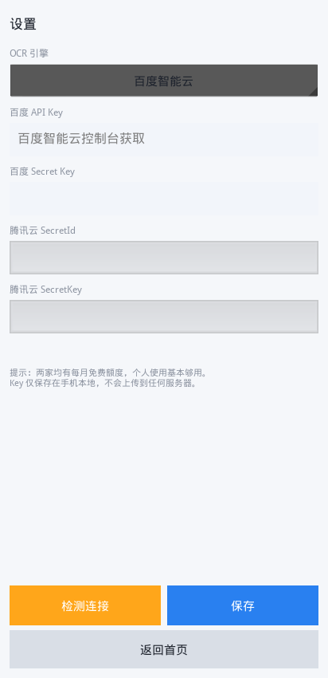

# 轻记账 · 轻量安卓记账 APP

一个用 **Python (Kivy)** 写的安卓记账应用，核心能力是**拍图 / 传截图自动记账**。

> 拍一张账单截图或纸质小票 → 自动识别金额、商户、时间、分类 → 确认无误即入账。

| 首页 | 识别确认 | 账目明细 |
|---|---|---|
|  |  |  |

| 统计 | 手动记账 | 设置 |
|---|---|---|
|  |  |  |

> 以上截图为 APP 在 412×850 分辨率下的真实运行画面。

---

## 目录

- [功能特性](#功能特性)
- [快速开始（3 步出 APK）](#快速开始3-步出-apk)
- [获取 OCR API Key](#获取-ocr-api-key)
- [项目结构](#项目结构)
- [本地开发调试](#本地开发调试)
- [常见问题](#常见问题)
- [设计与技术说明](#设计与技术说明)

---

## 功能特性

### 核心：图片自动记账

| 能力 | 说明 |
|---|---|
| **支付宝/微信/银行截图识别** | 自动提取金额、商户、交易时间，自动判断收入/支出 |
| **纸质小票拍照识别** | 内置图像预处理（灰度化 + 自适应二值化 + 放大 + 锐化），提升小票识别率 |
| **智能抗干扰** | 自动排除「余额」「优惠」「积分」等干扰金额，优先取「实付/合计」 |
| **自动分类** | 基于商户关键词自动归类到餐饮/交通/购物/居住等 9 大类 |
| **多金额消歧** | 一张图有多个金额时取主金额，并明确提示用户核对 |

### 其他

- **手动记账** — 金额、分类、商户、日期时间、备注
- **明细查询** — 按收入/支出筛选、全文搜索商户/备注
- **数据统计** — 本周/本月/本年，分类构成横向条形图、日均支出、结余
- **CSV 导出** — 带 BOM，Excel 打开不乱码
- **本地优先** — 数据全部存在手机本地 SQLite，不经过任何第三方服务器
- **引擎可插拔** — 百度 / 腾讯云随意切换，也支持离线模拟引擎

---

## 快速开始（3 步出 APK）

### 为什么要在云端构建？

> Buildozer 打包安卓 APK **只能在 Linux 或 WSL2 下运行**，Windows 和 macOS 原生环境都不行，还需要下载 Android SDK + NDK（约 3GB）。

**GitHub Actions 方案可以完全绕过这些**——你只需要把代码推到 GitHub，云端自动帮你出包。

### 步骤

**第 1 步：把代码推到你自己的 GitHub 仓库**

```bash
cd MyLedger
git init
git add .
git commit -m "feat: 轻记账 App 初始版本"
git branch -M main
git remote add origin https://github.com/<你的用户名>/<仓库名>.git
git push -u origin main
```

**第 2 步：等待云端自动构建**

推送后会自动触发构建，到仓库页面 **Actions** 标签页可以看到进度。

- 首次构建约 **25~40 分钟**（要下载 Android SDK/NDK）
- 之后有缓存，约 **8~15 分钟**

**第 3 步：下载并安装 APK**

构建成功后，在 Actions 页面点进那次运行，页面底部 **Artifacts** 区域下载 `myledger-apk.zip`，解压得到 `.apk` 文件。

把 APK 传到手机安装即可（需在系统设置里允许「安装未知来源应用」）。

> **想要固定下载链接？** 打个 tag 就会自动发布到 Releases：
> ```bash
> git tag v1.0.0 && git push origin v1.0.0
> ```
> 之后在仓库 **Releases** 页面就能直接下载。

> **首次构建为什么慢？** 要下载 Android SDK + NDK 共约 3GB。工作流已配置缓存，第二次起会快很多。
> 想更快可以编辑 `buildozer.spec`，把 `android.archs` 改成只留 `arm64-v8a`（现代手机都是这个架构）。

---

## 获取 OCR API Key

APP 需要 OCR 服务才能识别图片。**百度**和**腾讯云**都有每月免费额度，个人记账完全够用。

### 方案 A：百度智能云（推荐）

1. 打开 [百度智能云 OCR 控制台](https://console.bce.baidu.com/ai/#/ai/ocr/overview/index)
2. 注册并实名认证（个人认证即可）
3. 进入**文字识别 → 通用文字识别（高精度版）**，点击「领取免费资源」
4. 左侧菜单 **应用列表 → 创建应用**，勾选文字识别
5. 创建后会拿到 **API Key** 和 **Secret Key**，填入 APP 设置页

> 免费额度：通用文字识别（高精度版）每月 1000 次，以官网最新政策为准。

### 方案 B：腾讯云

1. 打开 [腾讯云 OCR 控制台](https://console.cloud.tencent.com/ocr)
2. 开通文字识别服务，每月 1000 次免费
3. 访问 [访问管理 → API 密钥](https://console.cloud.tencent.com/cam/capi) 获取 **SecretId** 和 **SecretKey**
4. 填入 APP 设置页

### 方案 C：先试后配

设置页把引擎切换成 **「离线模拟（测试）」**，无需任何 Key 即可体验完整流程（返回固定测试文本）。

---

## 项目结构

```
MyLedger/
├── main.py                      # 应用入口
├── buildozer.spec               # APK 打包配置
├── requirements.txt
├── app/
│   ├── core/                    # 业务核心（不依赖 UI，可独立测试）
│   │   ├── models.py            #   数据模型、金额换算
│   │   ├── db.py                #   SQLite 持久化
│   │   ├── config.py            #   配置管理
│   │   └── service.py           #   业务门面（串联 DB/OCR/配置）
│   ├── ocr/
│   │   ├── engines.py           #   OCR 引擎（百度/腾讯/Mock，可插拔）
│   │   └── parser.py            #   ★ 票据解析器（核心算法）
│   └── ui/
│       ├── main.py              #   Kivy 界面逻辑
│       └── ledger.kv            #   KV 界面描述
├── tests/
│   └── run_tests.py             #   核心逻辑测试（57 项）
└── .github/workflows/
    └── build-apk.yml            # 云端构建 APK
```

**分层设计**：`core` 和 `ocr` 完全不依赖 Kivy，因此可以在任何环境（包括 CI）跑测试，不需要图形界面。

---

## 本地开发调试

### 桌面端运行界面（可选）

想在电脑上直接看界面效果：

```bash
# 1. 建虚拟环境
python3 -m venv .venv && source .venv/bin/activate

# 2. 装依赖
pip install kivy requests pillow plyer

# 3. 运行
python main.py
```

> Linux 下若报 `Unable to find any valuable Window provider`，安装图形库：
> ```bash
> sudo apt install libsdl2-2.0-0 libsdl2-image-2.0-0 libgl1 xvfb
> ```

### 跑测试

```bash
pip install requests pillow
python tests/run_tests.py
```

覆盖 57 项断言：金额换算精度、票据解析、收支判定、数据库 CRUD、统计、CSV 导出、OCR 引擎、配置容错、时间区间。

### 本地打包 APK（仅 Linux / WSL2）

```bash
sudo apt install -y git zip unzip openjdk-17-jdk autoconf libtool pkg-config \
                    zlib1g-dev libncurses5-dev libncursesw5-dev cmake libffi-dev libssl-dev
pip install buildozer cython==0.29.36
buildozer -v android debug
# 产物在 bin/ 目录
```

---

## 常见问题

<details>
<summary><b>识别不准怎么办？</b></summary>

1. **确认图片清晰** — 截图尽量原图不压缩；拍小票时把票据铺平、光线充足、避免阴影
2. **确认票据类型选对** — 界面上的「票据类型」要选「截图」或「纸质小票」，两者预处理流程不同
3. **看 OCR 原始文本** — 确认识别页底部有「OCR 原始文本」，能看出是 OCR 错还是解析错
4. **多金额场景** — 会提示「已选最大的一项」，请手动核对
5. **识别结果一律可编辑** — 金额、商户、分类、时间都能改，改完再保存

</details>

<details>
<summary><b>提示「未配置 OCR」</b></summary>

到「设置」页填入 API Key 并点「检测连接」验证。详见[获取 OCR API Key](#获取-ocr-api-key)。

</details>

<details>
<summary><b>提示鉴权失败 / access_token 无效</b></summary>

- 检查 Key 有没有多余空格（复制时容易带上）
- 百度：确认应用已勾选「文字识别」权限
- 腾讯云：确认已开通 OCR 服务、账户无欠费
- 用「检测连接」按钮快速验证，比截图试错快

</details>

<details>
<summary><b>提示调用量超限</b></summary>

免费额度用完了。百度控制台可查看今日用量；次日自动恢复。个人使用 1000 次/月通常足够（相当于每天 33 张图）。

</details>

<details>
<summary><b>APK 装不上 / 解析包错误</b></summary>

- 确认手机架构：`buildozer.spec` 里默认打包了 `arm64-v8a` 和 `armeabi-v7a`，覆盖绝大多数机型
- 老手机（2015 年前）可能是 `armeabi`，需要自行添加该架构重新打包
- 必须在系统设置里允许「安装未知来源应用」

</details>

<details>
<summary><b>换手机怎么迁移数据？</b></summary>

在「明细」页点「导出」生成 CSV，把文件拷到新手机。目前导入需手动处理，后续可加。

</details>

<details>
<summary><b>首次构建 Actions 失败了？</b></summary>

常见原因：
- **超时** — 网络慢导致下载 NDK 超时，重新运行一次即可（有缓存会快）
- **缓存损坏** — 到 Actions 页面删除缓存后重试
- 若持续失败，把失败日志贴出来排查

</details>

---

## 设计与技术说明

### 为什么金额用「分」存整数？

浮点数有精度问题：`0.1 + 0.2 != 0.3`。记账对精度零容忍，所以**所有金额以「分」为单位存整数**，展示时再除以 100。转换用 `Decimal` 而非 `float`。

### 为什么识别结果一定要用户确认？

OCR 不可能 100% 准确——截图压缩、字体异常、票据版式变化都会导致误识别。**静默入库等于给用户埋雷**，事后查账的痛苦远大于确认一下的成本。

所以本 APP 的设计原则是：**识别结果一律进确认页，字段全部可编辑，附带置信度和警告提示。**

### 票据解析器怎么工作的？

`app/ocr/parser.py` 是核心，流程：

1. **提取金额**（三级优先级）
   - 关键字引导：`实付/付款/合计 + 金额` — 置信度 0.92
   - 带币种符：`¥35.50 / -￥200` — 置信度 0.80
   - 纯数字行兜底 — 置信度 0.50
2. **排除干扰** — 含「余额/优惠/积分/额度」等词的行不作为金额候选（除非同时有「实付」类关键字）
3. **判断收支** — 优先级：金额符号 > 强收入词 > 词频统计
4. **提取商户** — 线索词（收款方/商户）> 后缀匹配（公司/店/超市）> 首个中文短行
5. **规整时间** — 兼容 5 种常见日期格式，含跨年修正
6. **推断分类** — 关键词映射表

**踩过的坑**（已修复并有测试覆盖）：
- 「微信**支付**」是 App 名不是交易行为，会让收款被误判为支出 → 判断前先剔除平台名
- `¥1,234.56` 的千分位逗号导致转换异常 → 清洗时统一去除
- 小票有多个商品金额，直接取最大会把单项当总额 → 优先匹配「合计」关键字

### 中文字体为什么内置？

Kivy 默认的 Roboto 字体不含 CJK 字形，中文会显示成方块。APP 内置了
**文泉驿微米黑**（`assets/fonts/wqy-microhei.ttc`，约 5MB），在 KV 里全局覆盖
`Label/Button/TextInput/Spinner` 的默认字体。界面上刻意不使用 emoji 图标，
因为内置字库不含 emoji 字形，会渲染为方块。

### 为什么用 Mock 引擎？

单元测试不能依赖网络和真实 API（慢、不稳定、要花钱）。Mock 引擎返回固定文本，让整条链路可测。同时它也让**没配 Key 的用户可以先体验流程**。

### 隐私

- 账目数据、API Key **全部存在手机本地**（`settings.json` 在 APP 私有目录，其他应用无法访问）
- 只有**识别图片这一步**会调用 OCR 服务商接口，图片不做其他用途
- 不含任何统计埋点

---

## 技术栈

- **Python 3.11** + **Kivy 2.3** — 跨平台 GUI
- **Buildozer** + **python-for-android** — APK 打包
- **SQLite**（标准库）— 本地存储
- **requests** — OCR 接口调用（腾讯云 v3 签名手写实现，省掉 SDK 体积）
- **Pillow** — 图片压缩与小票预处理
- **plyer** — 调用系统相册

---

## 已知限制

- 目前只支持**单张图片**记账，不支持多图批量（可扩展）
- CSV 支持导出，暂不支持导入
- 云同步未实现（设计上优先隐私和离线可用）
- 月度预算和超支提醒未实现

---

## 许可

MIT License，可自由修改和分发。
